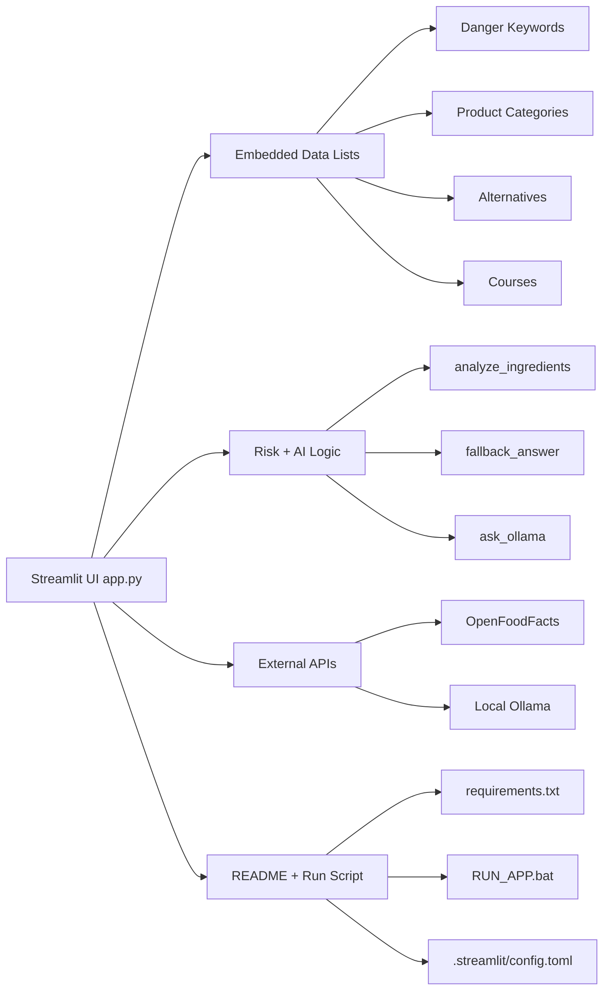

# Feature Mapping Diagram

```mermaid
flowchart TB
    A["Eng. Mohamed Sameh | Life Guard | Learning Tool"] --> B["Main Navigation"]
    A --> C["Shared Foundation"]

    B --> F["الغذاء"]
    B --> M["الأدوية"]
    B --> L["التعلم"]

    C --> C1["Arabic RTL Layout"]
    C --> C2["Dark Medical-Tech Theme"]
    C --> C3["Medical Safety Disclaimer"]
    C --> C4["Fixed Footer: Design and creation | Ahmed Labib | ©️"]
    C --> C5["Ollama AI + Rule-Based Fallback"]

    F --> F1["ليه ده وحش"]
    F --> F2["حاجات لازم تبطلها حالًا"]
    F --> F3["بدائل لذيذة"]
    F --> F4["امسح QR أو باركود"]
    F --> F5["اسأل الذكاء"]

    F1 --> F1A["Vegetable Oils / Oxidation"]
    F1 --> F1B["HNE Explanation"]
    F1 --> F1C["Chronic Inflammation"]
    F1 --> F1D["Hydrogenated Fats"]
    F1 --> F1E["Sugar and Glucose"]
    F1 --> F1F["Refined Carbohydrates"]
    F1 --> F1G["Ultra-Processed Additives"]
    F1 --> F1H["Final Strong Food Rule"]

    F2 --> F2A["Search Product Library"]
    F2 --> F2B["Risk Filter: All / HIGH / MEDIUM"]
    F2 --> F2C["Danger Categories"]
    F2C --> F2C1["Snacks and Chips"]
    F2C --> F2C2["Biscuits / Wafers / Cakes"]
    F2C --> F2C3["Commercial Pastries"]
    F2C --> F2C4["Spreads and Cream Fillings"]
    F2C --> F2C5["Mayonnaise and Sauces"]
    F2C --> F2C6["Fast Food and Fried Food"]
    F2C --> F2C7["Frozen Pre-Fried Food"]
    F2C --> F2C8["Instant Noodles and Powder Meals"]
    F2C --> F2C9["Plant Milks and Creamers"]
    F2C --> F2C10["Canned Food in Oil"]

    F3 --> F3A["Delicious Swaps"]
    F3 --> F3B["Shopping List"]
    F3A --> F3A1["Chips -> Homemade Popcorn"]
    F3A --> F3A2["Nutella -> Tahini + Cocoa"]
    F3A --> F3A3["Mayo -> Greek Yogurt Sauce"]
    F3A --> F3A4["Fried Food -> Oven / Grilled Alternatives"]

    F4 --> F4A["In-App Camera via Streamlit"]
    F4 --> F4B["Manual Barcode Entry"]
    F4 --> F4C["OpenFoodFacts Lookup"]
    F4 --> F4D["Manual Ingredients Entry"]
    F4 --> F4E["Ingredient Risk Analysis"]
    F4E --> F4E1["HIGH RISK / MEDIUM RISK / LOW RISK"]
    F4E --> F4E2["Red Flag Ingredients"]
    F4E --> F4E3["Explanation"]
    F4E --> F4E4["Final Recommendation"]
    F4E --> F4E5["Safer Alternative"]
    F4E1 --> F4E6["High-Risk Warning + Toast Alarm"]

    F5 --> F5A["Flexible Arabic Questions"]
    F5 --> F5B["Egyptian Arabic Tone"]
    F5 --> F5C["Food Knowledge Base Answers"]
    F5 --> F5D["Medicine Safety Redirect"]
    F5 --> C5

    M --> M1["Locked Coming Soon Module"]
    M --> M2["Safety Message"]
    M --> M3["Future Cards"]
    M2 --> M2A["Do Not Stop or Change Medicine Without Oncologist"]
    M3 --> M3A["Doctor Questions"]
    M3 --> M3B["Supplements Warning"]
    M3 --> M3C["Food-Drug Interactions"]
    M3 --> M3D["Symptoms Log"]
    M3 --> M3E["Dose Reminders"]

    L --> L1["يعني إيه؟"]
    L --> L2["Stakeholder Value Proposition"]
    L --> L3["Project Positioning"]
    L --> L4["Communication Plan as Marketing"]
    L --> L5["Personal Branding"]
    L --> L6["Client Pitch"]
    L --> L7["Case Study"]
    L --> L8["AI Explanation"]
    L --> L9["Free Courses"]

    L1 --> L1A["Marketing = Value Communication"]
    L2 --> L2A["Stakeholder Needs / Value / Risk / Message"]
    L3 --> L3A["Why Project Matters / Business Value / Success"]
    L4 --> L4A["Reports, Dashboards, Claims, Presentations"]
    L5 --> L5A["Clear, Credible, Structured, Data-Driven"]
    L6 --> L6A["Problem -> Impact -> Solution -> Evidence -> Next Action"]
    L7 --> L7A["Bad Communication vs Strong Marketing Communication"]
    L8 --> C5
    L9 --> L9A["HubSpot Academy"]
    L9 --> L9B["Google Skillshop"]
    L9 --> L9C["Coursera"]
    L9 --> L9D["Alison"]
```

## Implementation Map

```mermaid
flowchart LR
    UI["Streamlit UI app.py"] --> DATA["Embedded Data Lists"]
    UI --> LOGIC["Risk + AI Logic"]
    UI --> API["External APIs"]
    UI --> DOCS["README + Run Script"]

    DATA --> D1["Danger Keywords"]
    DATA --> D2["Product Categories"]
    DATA --> D3["Alternatives"]
    DATA --> D4["Courses"]

    LOGIC --> R1["analyze_ingredients"]
    LOGIC --> R2["fallback_answer"]
    LOGIC --> R3["ask_ollama"]

    API --> A1["OpenFoodFacts"]
    API --> A2["Local Ollama"]

    DOCS --> X1["requirements.txt"]
    DOCS --> X2["RUN_APP.bat"]
    DOCS --> X3[".streamlit/config.toml"]
```
